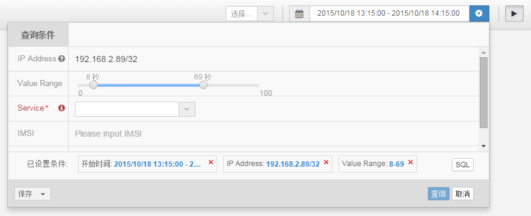
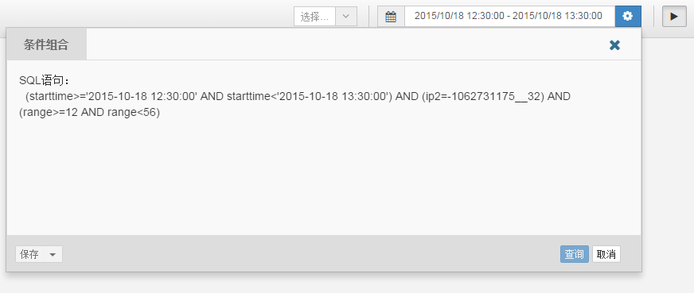

# queryForm for Angular.js
queryForm is to auto generate query option form by config, and generate SQL or other custom by youself.

## Features ##
- generate query form by config
- validate option value and show error information
- generate SQL of options

## Usage Screenshot

- Query Panel


- SQL


## Support option types
 1. Input
   - support single or multi value;
   - support various data types:string,number,IPv4,IMSI,IMEI,PC etc;
 2. Select
 3. Range
   - support single or range value
 4. Datetime

## Instalation
-**Bower**

The easiest way to install the picker is:
```
bower install iu-queryForm --save
```

-**Manual**

Download this dist version and dependencies.

## Basic usage
- Declare dependency.

```
App = angular.module('app', ['iu']);
```

- Prepare config of option item. 

  The option is same as echarts option define: 

```
framework.queryOptions = {
        datetime: {
            fieldName: 'starttime',
            required: true,
            fieldType: framework.datatype.datetime,
            allowMultiValue: true,
            caption: '开始时间',
            placeholder: '请输入时间',
            directive: 'iuQueryDatetime',
            beforeMonths: [0, 0],
            beforeDays: [0, 0],
            beforeHours: [-1, 0],
            beforeMinutes: [0, 0],
            CurTimeType: 'Hour'
        },
        range: {
            caption: 'Value Range',
            fieldName: 'range',
            fieldType: framework.datatype.int,
            unit: '秒',
            rate: 1,
            setp: 1,
            isRange: true,
            range: [0, 100],
            min: {
                operator: '>=',
                value: 5
            },
            max: {
                operator: '<',
                value: 10
            },
            directive: 'iuQueryRange'
        }
    }
```

- Declare option model in controller.
```
$scope.queryOption = {
        fields:['datetime','range']
    };
```

- Add directive `iuQueryForm` to HTML and bind it to model.

```
<data-iu-query-form compact="true" data-query="query(result)" option="param.queryOption"></data-iu-query-form>
```

- In controller when trigger query:
```
$scope.query = function(result){
  ...
}
```
  The result is like:
```
{
  isValid: boolean,
  sql: string
}
```

- Also you can get result by interface:
```
var result = $scope.queryOption.$getResult();
```

- See `example.html` for demo.

## Author ##
[huke](email:ihuke@126.com)

## Thanks ##
[formly](https://github.com/formly-js/angular-formly)


